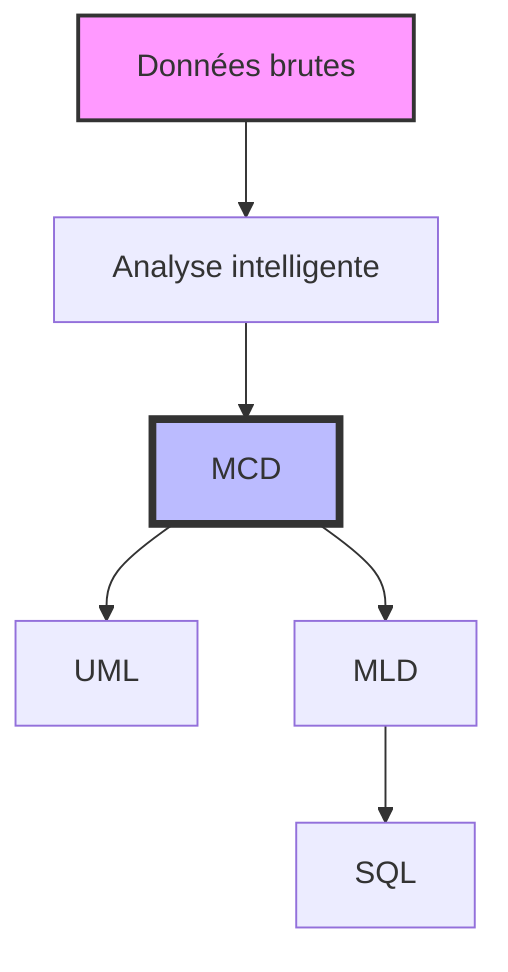

# BarrelMCD-python

<div align="center">


[](https://opensource.org/licenses/MIT)
[](https://www.python.org/downloads/)
[](https://www.qt.io/)

*Un outil simple et intuitif pour la modélisation de données*

[Documentation](#documentation) •
[Installation](#installation) •
[Utilisation](#utilisation) •
[Contribution](#contribution)

</div>

## 📖 À propos

BarrelMCD est un logiciel de modélisation de données écrit en Python. Né d'une volonté de simplifier la création de modèles conceptuels de données (MCD), il propose une approche intuitive et accessible.

> "La simplicité est la sophistication suprême" - Léonard de Vinci

### 🌟 Points forts



## ✨ Fonctionnalités

### 📥 Sources de données multiples
```
┌─────────────────┐
│  Sources        │
├─────────────────┤
│  ▪ Texte       │
│  ▪ JSON        │
│  ▪ CSV         │
│  ▪ Excel       │
│  ▪ Markdown    │ ✨ Nouveau !
└─────────────────┘
```

### 🧠 Analyse intelligente
- **Détection automatique**
  ```
  Texte → Entités → Relations → Cardinalités
  ```
- **Analyse sémantique**
- **Relations n-aires**

### 🏢 Domaines métier intégrés
| Domaine    | Entités pré-configurées | Relations types |
|------------|------------------------|-----------------|
| Commerce   | Client, Produit, etc.  | Commandes      |
| Medical    | Patient, Médecin, etc. | Consultations  |
| Education  | Étudiant, Cours, etc.  | Inscriptions   |

### 🔄 Conversions automatiques
```
MCD ──► UML
 │
 ├──► MLD
 │     │
 │     └──► SQL
 │
 └──► Documentation
```

### 📝 Import Markdown ✨ Nouveau !
- **Parsing automatique** des fichiers `.md`
- **Détection intelligente** des entités et associations
- **Validation en temps réel** du MCD
- **Interface intuitive** avec prévisualisation
- **Génération de templates** pour démarrer rapidement

```markdown
## Entité
- attribut (type) : description
- id (integer) PK : clé primaire

### Entité1 <-> Entité2 : Association
**Description de l'association**
Entité1 : 1,1
Entité2 : 0,n
```

## 🚀 Démarrage rapide

### Prérequis
- Python 3.8 ou supérieur
- pip (gestionnaire de paquets Python)
- Qt 5.15 ou supérieur

### Installation

```bash
# Cloner le dépôt
git clone https://github.com/yglsan2/BarrelMCD-python.git

# Se déplacer dans le répertoire
cd BarrelMCD-python

# Installer les dépendances
pip install -r requirements.txt
```

### Utilisation

#### Import depuis Markdown
```bash
# Lancer l'application
python main.py

# Utiliser le raccourci Ctrl+M ou cliquer sur le bouton "Markdown"
# Puis importer votre fichier .md ou éditer directement
```

#### Exemple de fichier Markdown
```markdown
# Système de Gestion de Bibliothèque

## Livre
- id (integer) PK : identifiant unique
- titre (varchar) : titre du livre
- auteur (varchar) : nom de l'auteur

## Lecteur
- id (integer) PK : identifiant unique
- nom (varchar) : nom du lecteur
- email (varchar) : adresse email

### Livre <-> Lecteur : Emprunte
**Un lecteur peut emprunter plusieurs livres**
Livre : 1,1
Lecteur : 0,n
```

```bash
# Lancer l'application
python main.py
```

## 📱 Interface utilisateur

L'interface a été pensée pour être :
- 🎨 Intuitive
- 📱 Responsive
- 🌙 Personnalisable
- 🤝 Accessible

### Aperçu de l'interface

```
┌─────────────────────────────────────────────┐
│ BarrelMCD                             _ □ X │
├─────────────────────┬───────────────────────┤
│  Configuration      │                       │
│ ┌───────────────┐  │      Visualisation    │
│ │ Type: MCD     │  │                       │
│ │ Source: JSON  │  │    [Diagramme MCD]    │
│ └───────────────┘  │                       │
│                    │                       │
│  Données           │                       │
│ ┌───────────────┐  │                       │
│ │              ↓│  │                       │
│ └───────────────┘  │                       │
│                    │                       │
│  Actions           │                       │
│ [Générer] [Export] │                       │
└─────────────────────┴───────────────────────┘
```

## 🤝 Contribution

Les contributions sont les bienvenues ! Voici comment participer :

1. 🍴 Fork le projet
2. 🌿 Créer une branche (`git checkout -b feature/amelioration`)
3. ✍️ Commiter les changements (`git commit -am 'Ajout d'une fonctionnalité'`)
4. 🚀 Pousser la branche (`git push origin feature/amelioration`)
5. 🎉 Ouvrir une Pull Request

### Guide de contribution


## 📄 Licence

Ce projet est sous licence MIT - voir le fichier [LICENSE](LICENSE) pour plus de détails.

## 🙏 Remerciements

Un grand merci à tous les contributeurs qui participent à l'amélioration de ce projet.

---

<div align="center">
Fait avec ❤️ par la communauté Python

[⬆ Retour en haut](#barrelmcd-python)
</div>
