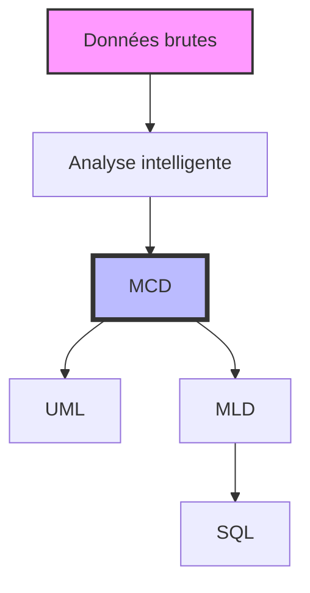

# BarrelMCD-python

<div align="center">


[](https://opensource.org/licenses/MIT)
[](https://www.python.org/downloads/)
[](https://flutter.dev/)

*Un outil simple et intuitif pour la modélisation de données*

[Documentation](#documentation) •
[Installation](#installation) •
[Utilisation](#utilisation) •
[Contribution](#contribution)

</div>

## 📖 À propos

BarrelMCD est un logiciel de modélisation de données (MCD/MLD/SQL). Né d'une volonté de simplifier la création de modèles conceptuels de données, il propose une approche intuitive et accessible.

**Changement de stratégie :** le projet est désormais un projet **Python / Dart (Flutter)** :
- **Backend Python** : logique métier (parsing Markdown, validation MCD, conversion MCD→MLD→SQL), exposée via une API FastAPI.
- **Interface Flutter** : application desktop (Linux, Windows, macOS) et évolutive (web, mobile), connectée à l’API.

> "La simplicité est la sophistication suprême" - Léonard de Vinci

### 🌟 Points forts



## ✨ Fonctionnalités

### 📥 Sources de données multiples
```
┌─────────────────┐
│  Sources        │
├─────────────────┤
│  ▪ Texte       │
│  ▪ JSON        │
│  ▪ CSV         │
│  ▪ Excel       │
│  ▪ Markdown    │
└─────────────────┘
```

### 🧠 Analyse intelligente
- **Détection automatique** : Texte → Entités → Relations → Cardinalités
- **Analyse sémantique**
- **Relations n-aires**

### 🔄 Conversions automatiques
```
MCD ──► UML
 │
 ├──► MLD
 │     │
 │     └──► SQL
 │
 └──► Documentation
```

### 📝 Import Markdown
- Parsing automatique des fichiers `.md`
- Détection des entités et associations
- Validation du MCD
- Interface avec prévisualisation (Flutter)
- Génération de templates

### 🖥️ Interface Flutter
- Canvas interactif : entités, associations, liens avec cardinalités
- Fichier : ouvrir / enregistrer (.bar, .json)
- Annuler / rétablir, suppression, explorateur d’éléments
- Panneau MLD / SQL (génération via l’API)
- Thème sombre aligné sur l’outil de référence

## 🚀 Démarrage rapide

### Prérequis
- **Python 3.8+** (backend API)
- **Flutter SDK** (interface)
- Environnement virtuel Python recommandé (venv) pour le backend

### Installation

```bash
# Cloner le dépôt
git clone https://github.com/yglsan2/BarrelMCD-python.git
cd BarrelMCD-python
```

**Backend (API Python)**  
Le script utilise un venv pour éviter les conflits avec le Python système (ex. Arch Linux) :

```bash
./run_api.sh
```

À la première exécution, un environnement virtuel `.venv` est créé et les dépendances sont installées. L’API est disponible sur http://127.0.0.1:8000.

**Interface Flutter**

```bash
cd barrelmcd_flutter
flutter pub get
flutter run -d linux   # ou chrome, windows, etc.
```

### Utilisation

1. Démarrer l’API : `./run_api.sh` (à la racine du projet).
2. Lancer l’app Flutter : `cd barrelmcd_flutter && flutter run -d linux`.
3. Dans l’interface : modes **Entité**, **Association**, **Lien** pour construire le MCD ; **Markdown** pour importer ; **MLD/SQL** pour voir le résultat.

Sans API, l’app Flutter reste utilisable (création, édition, sauvegarde .bar) ; l’import Markdown et la génération MLD/SQL nécessitent l’API.

## 📁 Structure du projet

| Répertoire / Fichier | Rôle |
|----------------------|------|
| `api/`               | API FastAPI (parse Markdown, validate, MCD→MLD→SQL) |
| `barrelmcd_flutter/` | Application Flutter (interface) |
| `views/`, `models/`  | Logique Python (parser, convertisseur, analyseur) |
| `main.py`            | Ancienne interface PyQt (optionnelle) |
| `run_api.sh`         | Lancement de l’API avec venv |

## 📄 Licence

Ce projet est sous licence MIT - voir le fichier [LICENSE](LICENSE) pour plus de détails.

## 🙏 Remerciements

Merci à tous les contributeurs qui participent à l’amélioration de ce projet.

---

<div align="center">

[⬆ Retour en haut](#barrelmcd-python)

</div>
