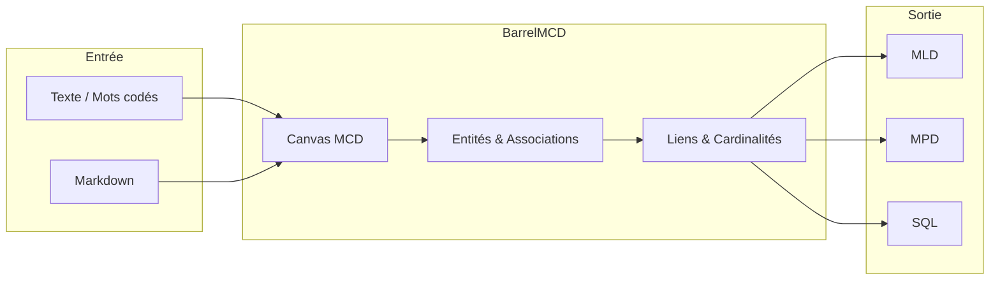
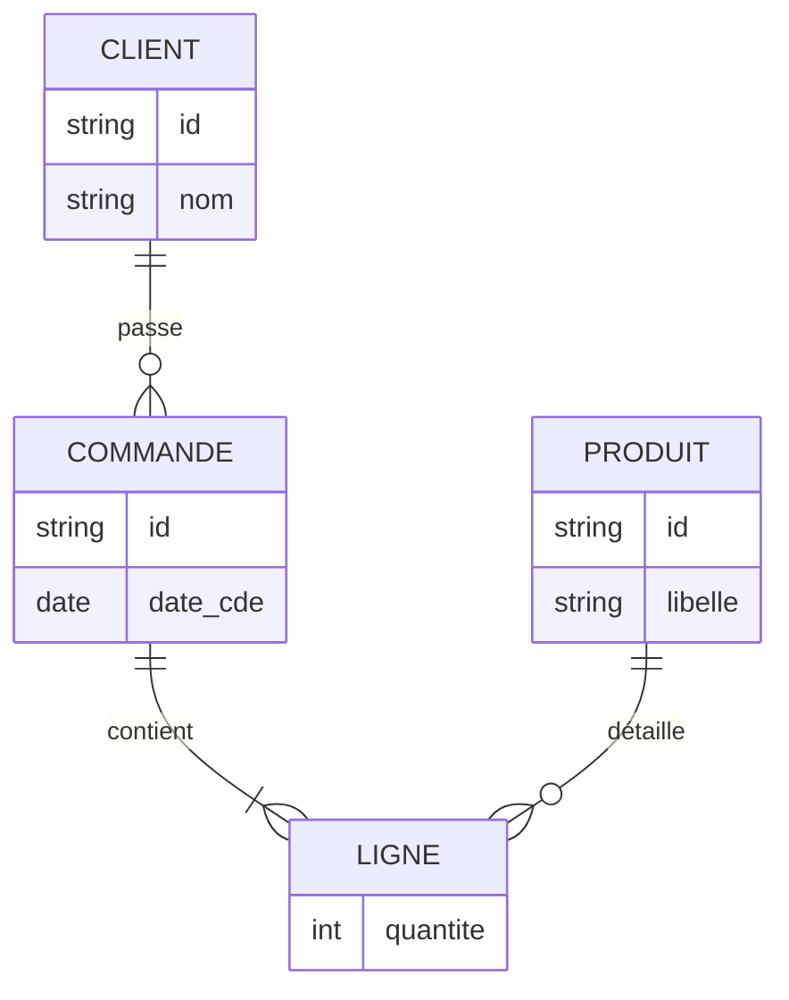

# BarrelMCD Flutter

Interface Flutter pour **BarrelMCD** — application de modélisation conceptuelle de données (MCD). Dessin d’entités, d’associations et de liens avec cardinalités, mise en page automatique, export MLD/MPD/SQL.

---

## Origine du projet

En formation, je ne trouvais pas de logiciel de MCD qui tournait correctement sur ma machine sous Arch Linux. J’ai donc commencé par développer un premier outil en **JavaScript**, utilisable dans le navigateur.

L’idée a ensuite évolué : je suis passé au développement en **Python**, puis j’ai fait le choix **Python / Flutter (Dart)** pour l’application actuelle. Ce couple me semblait le meilleur compromis pour proposer un logiciel **libre**, capable de produire des MCD rapidement, et **multiplateforme** (Linux, Windows, macOS, web).

---

## Spécificités de l’application

| Domaine | Détails |
|--------|---------|
| **Canvas** | Entités (rectangles), associations (losanges/ovales), liens avec cardinalités, édition à la souris, annuler / rétablir |
| **Liens** | Ligne droite, coudée ou courbe ; épaisseur ; formes d’extrémité (flèche, losange, bloc, point, carré) ; sens de la flèche |
| **Mise en page** | Automatique : force-directed, hiérarchique ou circulaire |
| **Export** | MLD, MPD, SQL pour plusieurs SGBD |
| **Héritage** | Liens d’héritage entre entités ; option pour la transposition MLD/MPD |
| **CIF / CIFF** | Contraintes d’intégrité fonctionnelle (symboles déplaçables) |
| **Import** | Format « mots codés » (texte) ou Markdown |
| **Notation** | Cardinalités en MCD (0,1 — 1,n) ou UML (0..1 — 1..*) |

### Export SQL : SGBD supportés

| SGBD | Export SQL |
|------|------------|
| MySQL | Oui |
| PostgreSQL | Oui |
| SQLite | Oui |
| SQL Server | Oui |

### Notation des cardinalités

| MCD | UML |
|-----|-----|
| 0,1 | 0..1 |
| 1,1 | 1..1 |
| 0,n | 0..* |
| 1,n | 1..* |

---

## Schéma du flux de travail

---

## Exemple conceptuel MCD

*BarrelMCD permet de dessiner ce type de schéma sur le canvas et d’exporter le modèle.*

---

## Auteur

**Développeur :** DesertYGL

---

## Licence

Ce projet est distribué sous **licence libre GNU GPL v3**.

| Vous pouvez | Condition |
|-------------|-----------|
| Utiliser l’application | — |
| Étudier le code | — |
| Modifier le logiciel | Conserver la GPL v3 |
| Redistribuer (y compris modifié) | Fournir le code source et la licence |

Le texte complet de la licence est dans le fichier [LICENSE](LICENSE).
